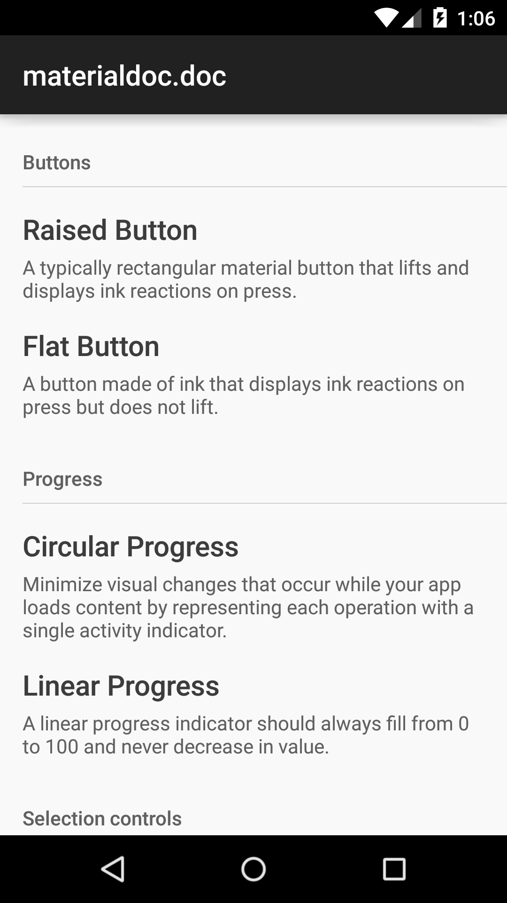
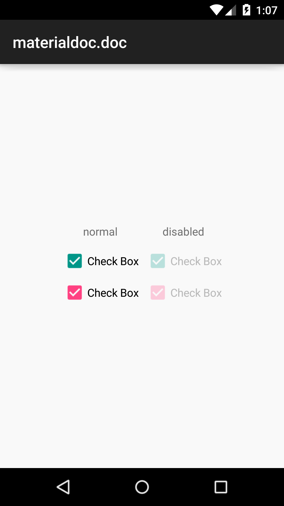

## About

This application includes all source code (layouts, styles, colors) of [materialdoc.com](http://www.materialdoc.com/) tutorials.

You can [download apk](https://github.com/materialdoc/materialdoc/releases) or install from [Play Store](https://play.google.com/store/apps/details?id=com.materialdoc&hl=en) and check how material components will look on different Android versions.

Latest version **1.2** includes:

- Buttons
  - Raised Button
  - Flat Button
  - Floating Action Button
- Dialogs
 - Alerts
 - Confirmation dialogs
- Menus
- Pickers
 - Date Picker
 - Time Picker
- Progress
  - Circular Progress
  - Linear Progress
- Selection controls
  - Check Box
  - Radio Button
  - Switch
- Snackbars & Toasts
- Tabs
- Text fields
  - Text field
  - Single-line text field
  - Multi-line text field
  - Full-width text field
  - Floating labels
  - User input errors
- Toolbars
- Other
  - Rating Bar

### Authors

- Roman Danylyk
- Dmytro Danylyk
